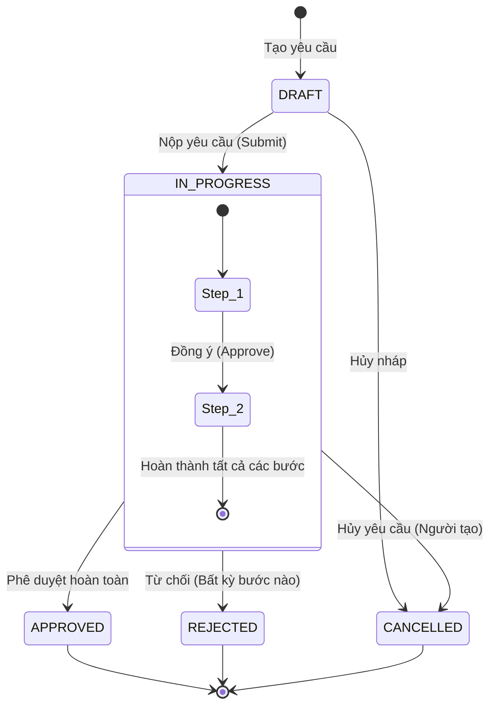
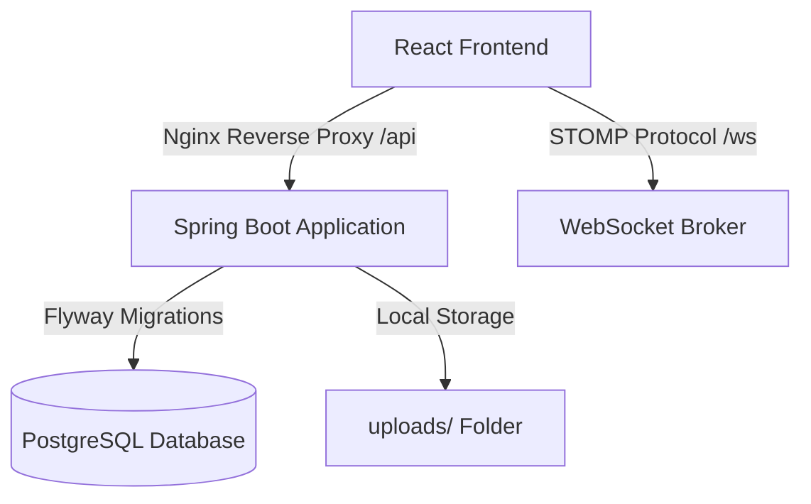
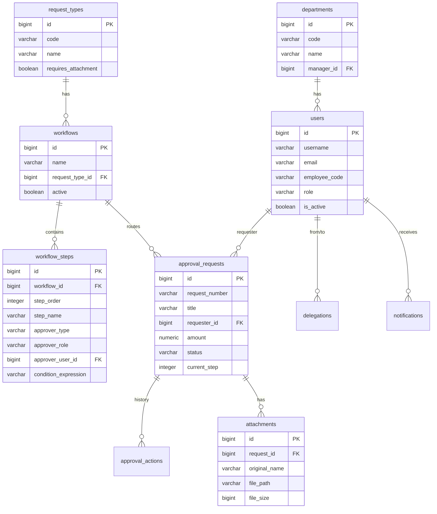

# BÁO CÁO CHI TIẾT HỆ THỐNG PHÊ DUYỆT NỘI BỘ (VIETTEL APPROVAL SYSTEM)

Báo cáo này mô tả toàn diện về kiến trúc kỹ thuật, thiết kế cơ sở dữ liệu, các tính năng nâng cao cấp doanh nghiệp đã được triển khai và cách vận hành hệ thống.

---

## 1. Tổng quan hệ thống

Hệ thống Phê duyệt Nội bộ là giải pháp số hóa quy trình luân chuyển và ký duyệt tờ trình đề xuất (nghỉ phép, tạm ứng, thanh toán, mua sắm trang thiết bị) trong doanh nghiệp. Hệ thống hỗ trợ định nghĩa linh hoạt luồng phê duyệt (Workflow) nhiều cấp, tự động hóa chuyển bước dựa trên điều kiện tài chính, ủy quyền khi vắng mặt và gửi thông báo thời gian thực.

### Công nghệ sử dụng (Technology Stack)
*   **Backend**: Spring Boot 3.5 (Java 17), Spring Security, Spring Data JPA, Flyway (DB Migration).
*   **Frontend**: React (Vite), Ant Design 5 (UI Framework), Axios, `@stomp/stompjs` (WebSocket).
*   **Cơ sở dữ liệu**: PostgreSQL 15.
*   **Thư viện nghiệp vụ**:
    *   **Spring Expression Language (SpEL)**: Phân tích biểu thức điều kiện động.
    *   **Apache POI**: Xuất báo cáo dữ liệu định dạng Excel (.xlsx).
    *   **STOMP/WebSocket**: Truyền tải thông báo real-time.
*   **Triển khai**: Docker & Docker Compose (Quản lý đa container).

---

## 2. Kiến trúc & Thiết kế luồng xử lý

### Sơ đồ luồng trạng thái của Yêu cầu (Request State Machine)

Một yêu cầu phê duyệt di chuyển qua các trạng thái sau dựa trên tương tác của người dùng và hệ thống:



### Kiến trúc công nghệ tổng thể



---

## 3. Thiết kế Cơ sở dữ liệu (Database Schema)

Cơ sở dữ liệu được quản lý tự động thông qua Flyway Migrations (gồm 7 phiên bản từ khởi tạo đến mở rộng). Dưới đây là các bảng cốt lõi:



> [!NOTE]
> **Ràng buộc duy nhất có điều kiện (Partial Unique Index)**
> Để giải quyết nghiệp vụ khi một tài khoản bị xóa (soft delete bằng cách đổi `is_active = false`), hệ thống sử dụng index bán phần:
> `CREATE UNIQUE INDEX idx_unique_active_username ON users(username) WHERE is_active = true;`
> Điều này đảm bảo: Tên đăng nhập/Email/Mã nhân viên chỉ duy nhất trên các tài khoản **đang hoạt động**, cho phép tái sử dụng lại thông tin đó cho nhân sự mới khi nhân sự cũ đã rời công ty.

---

## 4. Các tính năng doanh nghiệp đặc trưng đã triển khai

### 1. Biểu thức điều kiện động (SpEL)
*   **Chức năng**: Hệ thống tự động bỏ qua (skip) một bước duyệt nếu biểu thức điều kiện được thiết lập trả về `false`.
*   **Ví dụ biểu thức**: 
    *   `amount > 10000000` (Bước này chỉ cần duyệt nếu số tiền lớn hơn 10 triệu).
    *   `priority == 'URGENT'` (Chỉ duyệt khi độ ưu tiên khẩn cấp).
*   **Giải pháp**: Tận dụng Spring SpEL Engine, đưa toàn bộ đối tượng `ApprovalRequest` vào ngữ cảnh đánh giá (`EvaluationContext`). Lịch sử duyệt sẽ ghi nhận lý do tự động bỏ qua từ hệ thống.

### 2. Đính kèm tài liệu & Xác thực nghiệp vụ
*   **Chức năng**: Cho phép đính kèm hóa đơn, chứng từ. Hỗ trợ đầy đủ APIs tải lên (Multipart), tải xuống trực tiếp dưới dạng luồng dữ liệu (Blob) bảo mật thông qua Header JWT, và xóa tệp.
*   **Ràng buộc cấu hình**: Nếu Loại yêu cầu được cấu hình `requires_attachment = true`, API nộp đơn (`/submit`) sẽ chặn và trả về mã lỗi nếu người tạo chưa đính kèm tệp tin.

### 3. Ủy quyền phê duyệt (Delegation)
*   **Chức năng**: Cho phép người duyệt cấu hình ủy quyền quyền phê duyệt cho đồng nghiệp khác trong một khoảng thời gian được xác định (`start_date` đến `end_date`).
*   **Logic nghiệp vụ**:
    *   Khi người được ủy quyền đăng nhập, yêu cầu của người ủy quyền sẽ xuất hiện trong danh sách "Chờ tôi duyệt".
    *   Khi ký duyệt thay, hệ thống ghi nhận vào lịch sử hành động rõ ràng: *"Được phê duyệt bởi Nguyễn Văn B thay cho Nguyễn Văn A (Ủy quyền)"*.

### 4. Thông báo thời gian thực qua WebSocket & Nhật ký Email
*   **Chức năng**: Đẩy thông báo ngay lập tức mà không cần tải lại trang.
*   **Giải pháp**: Sử dụng cấu hình Message Broker STOMP dựa trên Websocket. Lắng nghe tại kênh cá nhân `/user/queue/notifications`.
*   **Trường hợp gửi**:
    *   Gửi tới người duyệt khi có yêu cầu mới cần xử lý ở bước tiếp theo.
    *   Gửi tới người tạo khi yêu cầu được phê duyệt hoàn toàn, bị từ chối hoặc cần bổ sung thông tin.
    *   Đồng thời in nhật ký gửi Email giả lập ra bảng điều khiển Console của ứng dụng phục vụ giám sát.

### 5. Xuất báo cáo Excel (Apache POI)
*   **Chức năng**: Cho phép Admin hoặc Người tạo tải dữ liệu danh sách yêu cầu lọc theo trạng thái ra định dạng `.xlsx`.
*   **Giải pháp**: Đọc dữ liệu thực tế, định dạng tiêu đề in đậm, tự động căn chỉnh kích thước các cột (Auto-size) và xuất luồng byte trực tiếp ra Client.

---

## 5. Hướng dẫn Triển khai & Chạy thử nghiệm

Hệ thống được đóng gói hoàn chỉnh bằng Docker Compose giúp tối giản hóa quy trình cài đặt trên bất kỳ môi trường nào.

### Các lệnh vận hành nhanh:

1.  **Khởi động toàn bộ hệ thống** (Tự động biên dịch mã nguồn, tải thư viện, cấu hình cơ sở dữ liệu và ánh xạ cổng):
    ```bash
    docker compose up -d --build
    ```
2.  **Kiểm tra trạng thái các dịch vụ**:
    ```bash
    docker compose ps
    ```
    *   `approval_frontend`: Chạy cổng `80` (Nginx).
    *   `approval_backend`: Chạy cổng `8080` (Spring Boot).
    *   `approval_postgres`: Chạy cổng `5432` (PostgreSQL).
3.  **Xem nhật ký chạy thực tế của Backend**:
    ```bash
    docker compose logs -f backend
    ```
4.  **Tài khoản thử nghiệm mặc định**:
    *   **Quản trị viên**: `admin` / `admin123` (Có toàn quyền quản lý người dùng, phòng ban, và workflow cấu hình).
